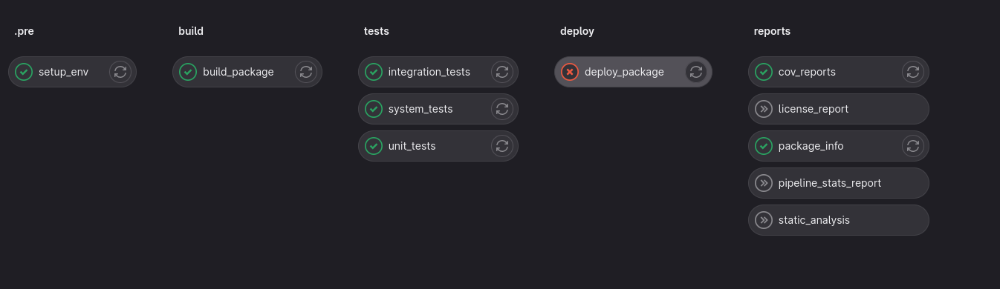

# pyproject_template


This is a Python project template I use as a base for my personal projects. It encapsulates the best practices I employ in most of my projects 
and leverages the [cookiecutter](https://github.com/cookiecutter/cookiecutter) tool to create the template.

# Features
* **Filesystem src layout**: Organized for efficient management.
* **Package Versioning**: Utilizes setuptools_scm for version control and uses git tags and CI/CD to manage versions.
* **Code Quality:** using git pre-commit hooks for code quality and static analysis tools such as pylint, mypy, flake8
* **Documentation:** using sphinx
* **Advanced GitLab-CI Pipeline Setup:** includes build, test, deploy, and report stages with features like:
  * **Private GitLab artifactory** for storing wheels and Docker images.
  * **Custom pipeline** support. You can choose what jobs to run and build your own pipeline from CLI or using json.
  * **CI Dev Image** Faster deployment using dev image which automatically identify changes in requirements or Dockerfile and rebuild itself next merge request
  * **Efficient DAG** dependencies for faster pipeline execution
  * **Tag Pipeline** - Identify when a tag is pushed and build a release with artifacts and documentation 
  * **Report Stage** - Collects all the information a manager might want to see in one place such as code quality reports, code coverage reports, package information, pipeline stats and more

  * **Cross Project Trigger** - Support sending artifact to another project and run a custom pipeline there.
  * **Encourage good development practices** - Tests are split into unit, integration and system tests. Unit tests are run on every commit, integration and system tests are run on merge request. 
  * **Split Merge Request from general push** - When the user opens a merge request, the pipeline will shift to more comprehensive tests and checks. This split allows for much quicker development process.
* **Testing Framework:** Split into unit, integration, and system levels using pytest and tox.
* **CLI Support:** Basic command-line interface using click. 
* **Project Post-Gen Initialization:** Automates git setup, pre-commit hooks, GitLab configuration, virtual environment, and project installation.
* **Quality Assurance:** Integrates tools like pylint, mypy, and flake8.
* documentation with sphinx


# Quick Start
**Install Cookiecutter** 
```bash
pip install -U cookiecutter
```

**Generate a Python package project:**
```bash
cookiecutter gl:perchick03/pyproject_template
```

**Initialization** (Optional)

```bash
cd <project_name>
source .venv/bin/activate 
<project_name> --version
```


# GitLab project setup

**Push to gitlab**
```bash
git push --set-upstream git@gitlab.example.com:username/new-repo.git master
```
## Set badges
In GitLab project, go to Settings -> General and expand Badges. Add Pipeline Status and Coverage badges as shown:


Name: Pipeline Status
Link: `https://gitlab.com/%{project_path}/-/commits/%{default_branch}`
Badge Image URL: `https://gitlab.com/%{project_path}/badges/%{default_branch}/pipeline.svg`


Name: Coverage
Link: `https://gitlab.com/%{project_path}/-/commits/%{default_branch}`
Badge Image URL: `https://gitlab.com/%{project_path}/badges/%{default_branch}/coverage.svg`

## Pipeline

### Features
* Custom pipeline support, can trigger jobs with json
* Using CI image for faster deployments
* Pipeline include
  * build wheel, sdist and validate
  * if tag is present, upload to gitlab private pypi
  * 


TODO: add more details


# Features


# Requirements
* Python 3.7+
* [cookiecutter](https://github.com/cookiecutter/cookiecutter)
* setuptools

`pip install --user cookiecutter`

# Usage

`cookiecutter gh:perchick03/pyproject_template`


for example, lets create dummy_project:
```bash
cookiecutter gl:perchick03/pyproject_template
````
```text
project_name []: dummy_project
full_name []: developer
email []: developer@example.com
version []: 0.1.0
Select initialize_project:
1 - yes
2 - no
Choose from 1, 2 [1]: 1
```
create new repo on gitlab
```bash
cd dummy_project
git remote add origin git@gitlab.com:developer/dummy_project.git
git push -u origin master
```

# Details

## Tools
### pre-commit

run pre-commit hooks
```bash
pre-commit run --all-files
```
