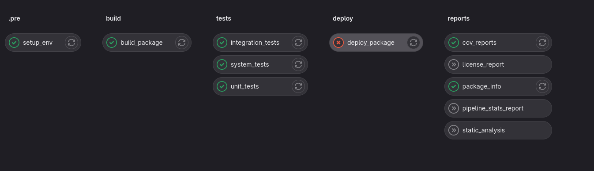

# pyproject_template


This is a template for a Python project I use in as base for my personal projects.
It is based on best practices I use in most of my projects.

I based on [cookiecutter](https://github.com/cookiecutter/cookiecutter) tool to create this template.

# Features
* filesystem src layout
* versioning with setuptools_scm
* git pre-commit hooks
* gitlab-ci pipeline setup
* tests
  * unit, integration and system split
  * using pytest
* basic cli with click
* project post-gen initialization - will initialize git and setup pre-commit hooks
* code quality tools such as pylint, mypy, flake8
* tox setup
* documentation with sphinx


# Quick Start
Install the latest Cookiecutter if you haven't installed it yet:
```bash
pip install -U cookiecutter
```

Generate a Python package project:
```bash
cookiecutter gl:perchick03/pyproject_template
```


# GitLab project setup
```bash
# To gitlab.com with SSH
git push --set-upstream git@gitlab.example.com:username/new-repo.git master

# To gitlab.com with HTTP
git push --set-upstream https://gitlab.example.com/username/new-repo.git master
```



for example, lets create dummy_project:
```bash
cookiecutter gl:perchick03/pyproject_template
````
```text
project_name []: dummy_project
full_name []: developer
email []: developer@example.com
version []: 0.1.0
Select initialize_project:
1 - yes
2 - no
Choose from 1, 2 [1]: 1
```
create new repo on gitlab
```bash
cd dummy_project
git remote add origin git@gitlab.com:developer/dummy_project.git
git push -u origin master
```


# Features


# Requirements
* Python 3.7+
* [cookiecutter](https://github.com/cookiecutter/cookiecutter)
* setuptools

`pip install --user cookiecutter`

# Usage

`cookiecutter gh:perchick03/pln-proj-template-py`

# Details

## Tools
### pre-commit

run pre-commit hooks
```bash
pre-commit run --all-files
```
